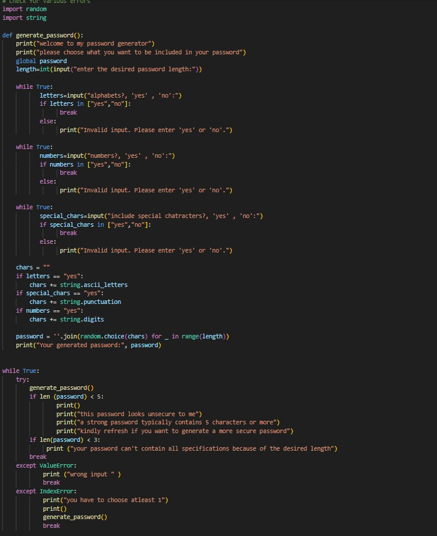
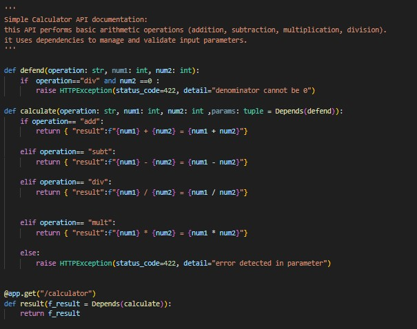
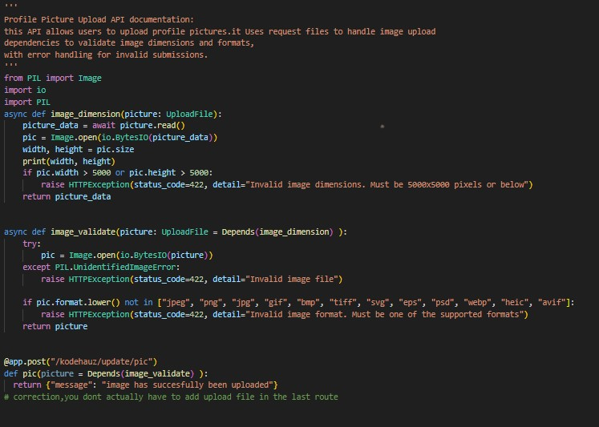
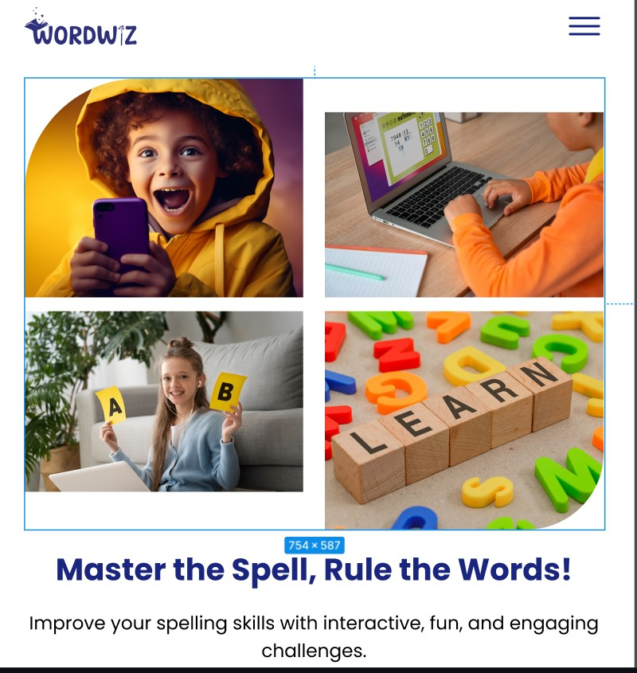

# Backend Developer
[View My GitHub Profile](https://github.com/duncan532)
### Skills and Technologies
Programming languages:
- Python

Frame-works:
- Fastapi
- Sqlalchemy

Databases:
- Postgresql

Tools/softwares:
- cloudinary
- postman
- vscode
- git/github

### Work Experience
##### Kode-camp 4.0 Backend Developer | 01 May - 31 August >>
###### Developed 20+ mini projects

- multiplication table generator

- Random password generator

  
- basic calculator api

  
- profile picture api

  
- and lots more..

### Projects:
##### Word_wiz_bee
Word_wiz_bee is a web-based spelling application designed to improve vocabulary and spelling skills. I collaborated with a cross-functional team to deliver an engaging and user-friendly experience.

- Developed backend API using FastAPI and SQLAlchemy
- Implemented user authentication and authorization
- Designed database schema using PostgreSQL
- Collaborated with frontend devs for seamless API integration

**Worked closely with**:
- front-end devs
- Devops
- UIUX designers
- fellow backend devolopers
  
**Tools/Softwares used**: 
- fastapi
- cloudinary
- smtp_mail_services
- git/github
- sqlite(for testing)
- postgresql(during deployment)
- sqlalchemy and others.
  
**Features_include**:
- games
- quizzes
- user_authentication
- progress tracking , etc.
  [Word-wiz-link](https://word-wiz-be-bsws.onrender.com/docs)

##### Skillet(display your expertise)
Skillet is a personal project that i am currently working on,it is a professional platform for users to showcase their projects, skills, and experiences.It allows users to create a personalized profile, upload projects, and share their work with others.

**key featutes**:
- commenting
- searching
- filtering and sorting projects
- media upload and management.
- Resume showcase
- Real-time Notifications(signup,forgot password)

##### Kodecamp website
I developed an informational website with a dynamic admin dashboard, enabling seamless control over information display. This robust platform allows administrators to effortlessly manage and update content in real-time, ensuring an engaging user experience.

**key featutes**:
- Dynamic Admin Dashboard
- Real-time Content Updates
- Content Management System (CMS)
- media upload and management.
- earch Engine Optimization (SEO)

**Tools/Softwares used**: 
- fastapi
- cloudinary
- smtp_mail_services
- git/github
- sqlite(for testing)
- postman(for testing)
- postgresql(during deployment)
- sqlalchemy and others.
  
-the apis are not yet live and the link will be posted as soon as possible

### Contact Information
- phone number: 09135953526
- email:uffangduncan@gmail.com
- [linkedin:](https://www.linkedin.com/in/duncan-uffang-bbb562304/)
- [Twitter](https://x.com/DUffang40559)
- [Facebook](https://web.facebook.com/profile.php?id=100075996586638)
